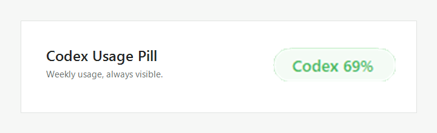

# Codex Usage Pill

[](https://github.com/zhaoxuandong001-alt/codex-usage-pill/actions/workflows/ci.yml)
[](https://github.com/zhaoxuandong001-alt/codex-usage-pill/releases/latest)
[](LICENSE)

A tiny, unofficial Windows overlay that keeps your Codex usage remaining visible while you work.



## Features

- Shows the remaining percentage for the weekly Codex usage window.
- Follows the Codex desktop window and hides when Codex is not active.
- Uses a compact `102 × 29` pixel pill that can be dragged anywhere inside the Codex window.
- Remembers its position between launches.
- Shows 5-hour and weekly windows, reset times, and last refresh time on hover.
- Changes from green to amber to red as remaining usage drops.
- Refreshes every five minutes, with manual refresh from the tray icon.
- Supports Codex sign-in without reading browser cookies or handling tokens itself.
- Runs as a single instance and uses no installer or background service.

## Requirements

- Windows 10 or Windows 11, 64-bit.
- Codex desktop or Codex CLI installed.
- A signed-in Codex account with usage limits available to the CLI.

## Install

1. Download `CodexUsagePill.exe` and `SHA256SUMS.txt` from the [latest release](https://github.com/zhaoxuandong001-alt/codex-usage-pill/releases/latest).
2. Optionally verify the SHA-256 checksum:

   ```powershell
   Get-FileHash .\CodexUsagePill.exe -Algorithm SHA256
   ```

3. Run `CodexUsagePill.exe`.
4. Bring the Codex desktop app to the foreground. The pill appears inside the Codex window.

The release executable is not code-signed. Windows may show a SmartScreen warning for a newly published build. Review the source and checksum before deciding whether to run it.

### Start with Windows

The app does not add itself to startup. To opt in:

1. Press `Win + R` and open `shell:startup`.
2. Place a shortcut to `CodexUsagePill.exe` in that folder.

## Controls

- Drag the pill to move it.
- Hover over it for detailed usage windows and reset times.
- Double-click the green tray icon to refresh immediately.
- Right-click the tray icon for refresh, reset position, sign-in, usage page, and exit commands.

## How it works

Codex Usage Pill locates the installed `codex.exe`, launches the local Codex `app-server` over standard input/output, and requests `account/rateLimits/read`. It converts the returned `usedPercent` values into remaining percentages and immediately terminates the helper process.

It does **not**:

- open or parse `auth.json`;
- read Chrome or browser cookies;
- save access or refresh tokens;
- send usage data to this project or another third-party service;
- modify Codex files or settings.

The app stores only the pill's last position in `%LOCALAPPDATA%\CodexUsagePill\position.txt`.

## Build from source

No package manager or external dependency is required. On Windows:

```powershell
git clone https://github.com/zhaoxuandong001-alt/codex-usage-pill.git
cd codex-usage-pill
.\build.ps1
```

The executable and checksum are written to `dist\`.

Useful diagnostic switches:

```powershell
.\dist\CodexUsagePill.exe --preview
.\dist\CodexUsagePill.exe --probe
.\dist\CodexUsagePill.exe --login
```

`--probe` prints a token-free JSON snapshot to the console only when the source is compiled as a console test host; the release build is a windowed application.

## Troubleshooting

**The pill does not appear**

- Make sure the Codex desktop window is open, restored, and in the foreground.
- Check the hidden-icons area of the Windows taskbar for the green `C` icon.
- Right-click the tray icon and choose **Reset position**.

**The pill shows `Codex —`**

- Right-click the tray icon and choose **Sign in to Codex…**.
- Confirm `codex.exe` is installed by running `codex --version` in PowerShell.

**Usage stopped updating after a Codex update**

The local app-server protocol can change. Open an issue with the Codex version and the error shown in the tooltip; do not include credentials or the contents of `auth.json`.

## Typography and branding

The published build uses the Windows system font `Segoe UI Semibold`. OpenAI Sans is not bundled or redistributed. Codex is a product of OpenAI. This community project is not affiliated with, endorsed by, or sponsored by OpenAI.

## Project notes

See [Project history and design decisions](docs/PROJECT_HISTORY.md) for the full evolution from the initial status-bar problem to the public release.

## Contributing and security

Contributions are welcome; see [CONTRIBUTING.md](CONTRIBUTING.md). Please report security problems as described in [SECURITY.md](SECURITY.md), not in a public issue.

## License

MIT © 2026 Joshua Dong. See [LICENSE](LICENSE).
